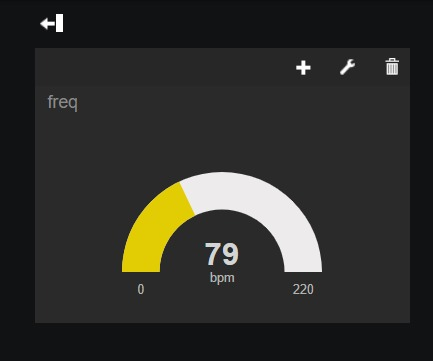

# Pulse Guard
Pulse guard, por uma saúde monitorada e precisa!

## Integrantes
- Enzo Shiotuqui  – RM 551508
- Murilo Roveri – RM 97893

## Link da simulação no Wokwi

- [Simulação](https://wokwi.com/projects/382736295727498241)

# Entendimento do Problema:
O monitoramento da saúde pessoal é essencial para prevenir doenças, promover o bem-estar e fornecer informações cruciais para intervenções médicas oportunas. No entanto, muitas pessoas enfrentam desafios para monitorar regularmente seus indicadores de saúde devido à falta de acessibilidade, conveniência e feedback em tempo real. Além de difícil acesso ao monitoramento confiável, a precisão é algo importante para ser  levado em conta. Nesse cenário ter um monitoriamento da saúde preciso confiável e acessível é algo raro de se ter 

# Solução:

Mediante a necessidade de estimular o monitoriamento e identificação de sintomas para prevenção de doenças, desenvolveu-se a plataforma PulseGuard.

Esta plataforma utiliza algoritmos para analisar dados comuns, como frequência cardíaca, glicose, qualidade do sono entre outras, e permite que o usuário monitore seus dados e veja alguma anormalidade 

Por exemplo, o armazenamento frequente da pressão arterial, junto a análise dos procedimentos realizado, facilita o diagnóstico de uma possível Infarto ou hipertensão , visto que com a retirada do resultado dos exames já haverá as estatísticas das alterações de pressão.

## IOT

Nossa proposta é desenvolver uma pulseira que integra a Internet das Coisas (IoT) e sensores de frequência cardíaca para otimizar a experiência do usuário no gerenciamento de sua saúde. A pulseira oferece uma plataforma segura e centralizada para o registro e armazenamento de sinais vitais, frequência cardíaca e outros indicadores vitais Além disso, incorporamos um código que registra o horário UTC de
cada leitura dos sensores, proporcionando um registro temporal preciso das informações coletadas.

Através do uso de sensores de frequência cardíaca e tecnologia IoT, os usuários podem monitorar continuamente sua saúde e registrar automaticamente esses dados no aplicativo. Isso não apenas simplifica o acesso aos históricos médicos, mas também possibilita a criação de gráficos e relatórios personalizados para um melhor acompanhamento da saúde do paciente.

## Imagem do sensor 

## Requisitos

No back-end do projeto, empregamos o Fiware . O Fiware facilita a coleta, armazenamento e transporte de dados capturados pelo sensor de freq-cardíaca. Esses dados são então integrados à nossa aplicação de front-end, onde são apresentados aos usuários de maneira clara e intuitiva.

No front-end do projeto, foi utlizado o [freeboard](https://freeboard.io/board/JSXCrM) para manejo das informações, foi apresentados os números e gráficos para ficar mais fácil da vizualização das informações da freq-cardíaca do usuário, sendo sempre claro e intuitivo.

<ul>
  Outros requisitos
  <li>Postman</li>
  <li>ESP 32</li>
  <li>LCD</li>
  <li>gerador de pulso</li>
</ul>
